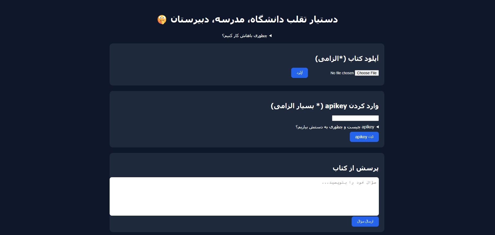

# دستیار تقلب در امتحانات مدرسه، دانشگاه، دبیرستان ☢️
با این هوش مصنوعی می تونی خیلی راحت تر توی امتحانات تقلب کنی!!
کافیه pdf جزوه رو وارد کنی سوال توی امتحان رو ازش بپرسی و تمام، سوال امتحان رو **از روی جزوه ات** جواب میده.



## چرا این؟ چرا `chatgpt` نه؟
اول از همه این دستیار سرعتمند تر از chatgpt هستش، چرا؟:
- پرامت آماده!!
- مطمعن بودن از جواب (از روی جزوه ای که دادی جواب میده).

> و کی چیزی که هست قراره هم در نسخه های بعدی کاربر پسند تر بشه و یک **RAG ai** تخصصی اضافه بشه!
## چگونه ازش استفاده کنیم؟:
اول از همه باید uv رو دانلود کنید:
```bash
pip install uv
```
و بعد پروژه رو کلون کنید(`git clone <url>` اگر گیت رو ندارید برد زیپ پروژه رو از قسمت code دانلود کنید) و برید به فایل پروژ و این دستور رو اجرا کنید:
```bash
uv sync
```
و همه وابستگی ها دانلود میشه!

و بعد این دستور رو اجرا کنید:
```bash
uv run app.py
```
و بعد به این سایت `http://127.0.0.1:2626` مراجعه کنید

در صورت از مشکلی به [من یعنی کیهان](https://t.me/keyhan_112) پیام بدین

> نکته: باید حتما python رو نصب داشته باشید.

### ⚠️ **هشدار** ⚠️
این پروژه هنوز آزمایشیه و نباید در محیط های واقعی ازش استفاده بشه!!

## قدم بعدی
1. اضافه کردن RAG AI 🤖
2. خوشگل کردن UI و UX 🍥
